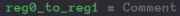
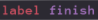
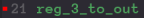
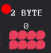

# Assembly

You can use a mix of assembly codes and numbers to set the bytes. Assembly codes are just synonyms for a bit pattern. For example, instead of typing 196 for "add", this code can be named "add" directly, simplifying reading and writing code.

Comments can be added using "#".  

Additionally, the `CONST` keyword can be used to name a value within a specific program.  

`LABEL` assigns a name to the byte offset of the line it was inserted on. This is especially useful for naming jump destinations.  

You can add, subtract, multiply, integer divide, modulo, OR, AND or XOR values together using +, -, \*, /, %, |, & or ^ respectively.

Breakpoints can be added by clicking to the left of a line number. The program will automatically pause at breakpoints when running.  

Breakpoints can also be added to any of the linked components, pausing the program when that state is changed. Click on the state and you will see the red dot.  

Finally, values can be specified in binary with the prefix 0b (so 5 could be 0b0101) and hex with the prefix 0x (so 15 would be 0x0f)
